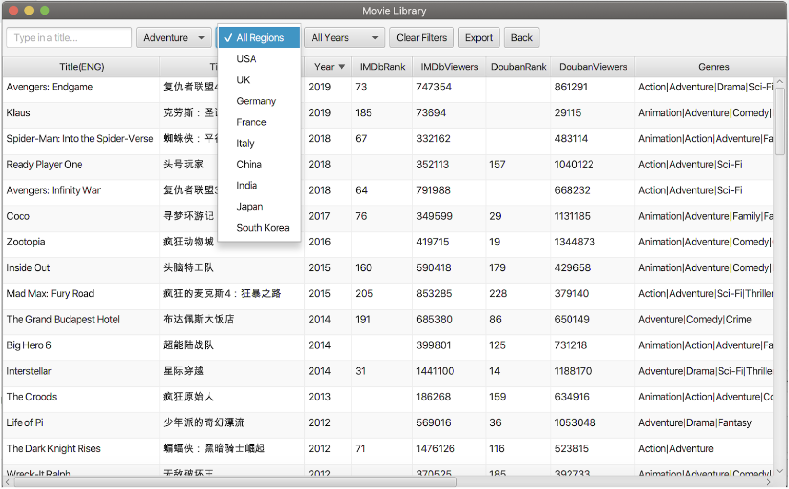
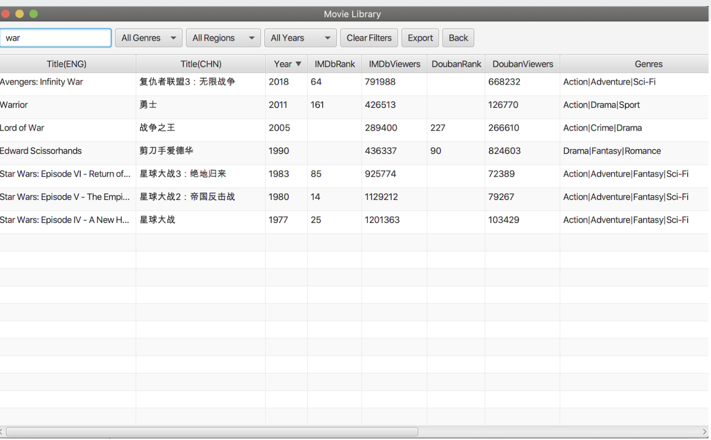
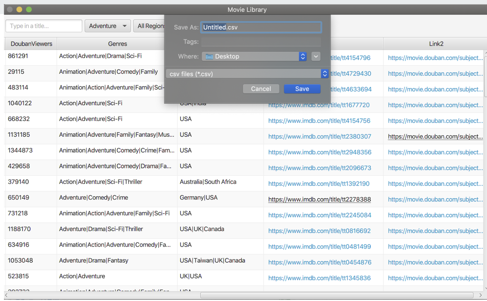

## Movie Web Crawler 
This is a project using Jsoup to parse movie information from two websites [IMDb Top Rated Movies](https://www.imdb.com/chart/top/?ref_=nv_mv_250) and [Douban Top 250](https://movie.douban.com/top250).    
You can refer to my [ slides](https://docs.google.com/presentation/d/1U0xx7O49xJbD0AxQXizDT9p9_sm5YPsxLQg0bL_BbJk/edit?usp=sharing) which explains how it works.
The aim is to find out how many movies are in both lists and how many movie is in one list only to form a static movie library for user to search, filter and export.(The data uploaded here is up till 30 July, 2020).

## Part1: movie crawler
- For IMBb, I used Mozilla user agent.
- For Douban, I used a naive approach to sleep for 5 seconds before parsing the next webpage. You can find the [constraints of douban](https://www.douban.com/robots.txt) web crawler here.

## Part2: search interface
I used javaFX to display the text files I got from part1. The interface is as below.     
The user can search by movie title in English, filter by dropdown boxes, sort by single column and export the results as a csv file.

