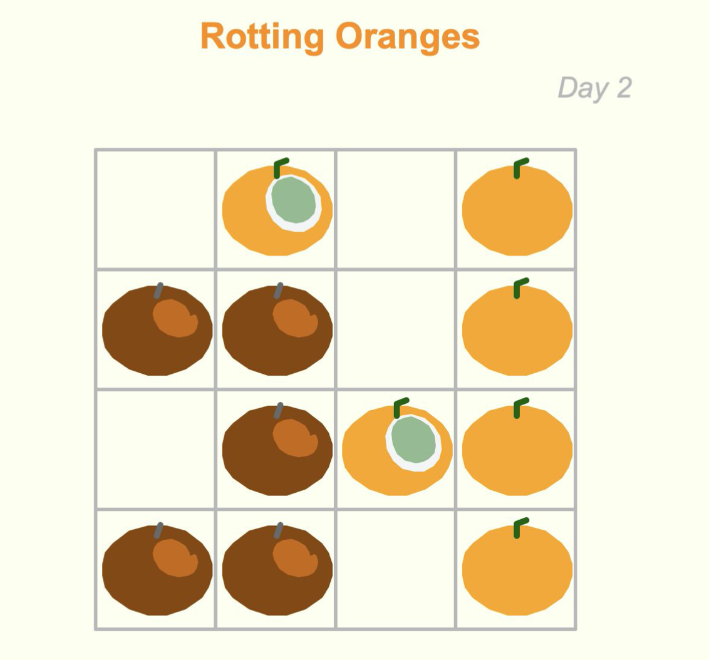

## Rotting Oranges

This program visualizes the changing process of a leetcode problem [rotting oranges](https://leetcode.com/problems/rotting-oranges/).  
It uses BFS approach to solve the problem and uses python turtle library 🐢 to draw the oranges🍊.

### How to play

To play with it, the keyboard commands are:

-   Press “Y” to start the process
-   Press “N” to see the next status
-   Press “P” to see the previous status

One more feature added is that you can swap two cells at the very beginning(either empty cell or with fresh/rotten oranges) to see how your rearrangement changes the final status of the oranges

-   Press ↑ ↓ ← → to move around
-   Press “Enter” to select an orange

To reset, you can rerun the file. To change the data(i.e. the initial status of each cell), you can change my_data matrix in the main function (line 308).
